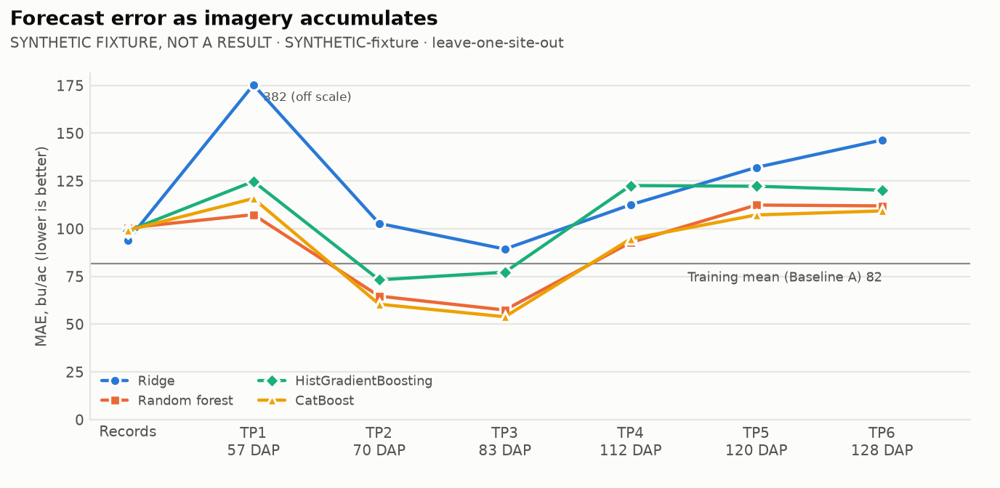
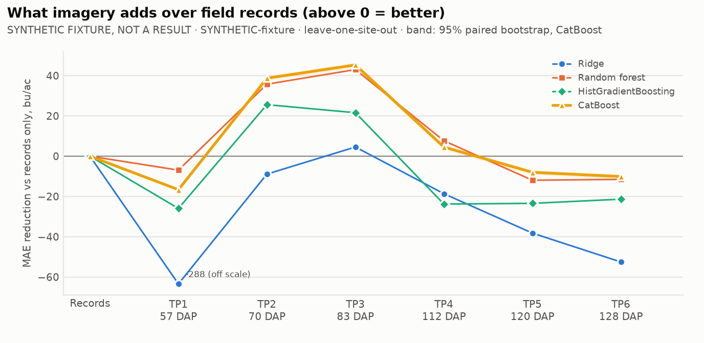
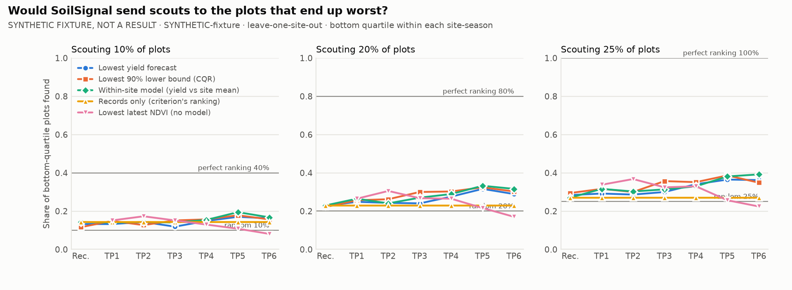
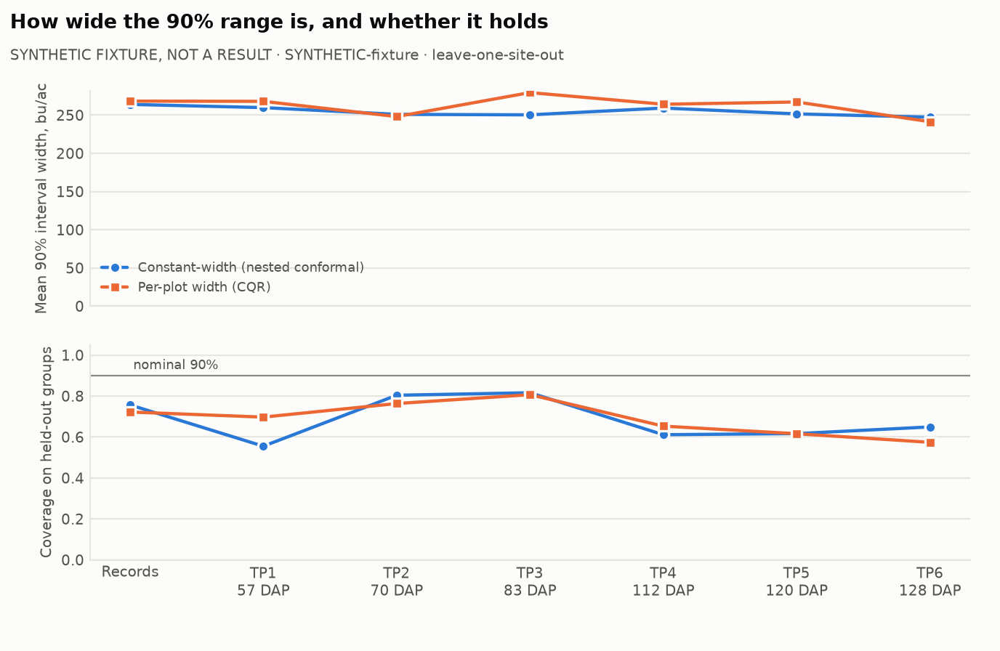
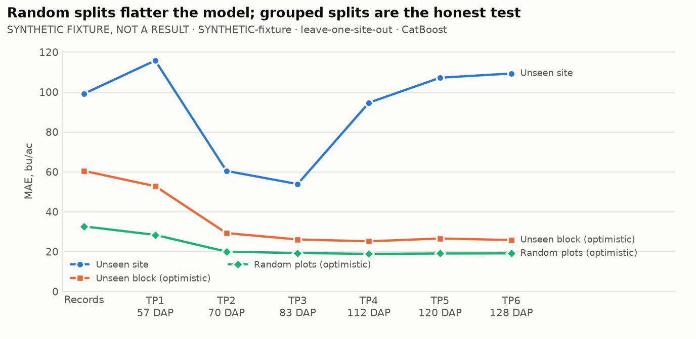

# Progressive early-signal experiment: SYNTHETIC-fixture

> **SYNTHETIC FIXTURE: NOT A RESULT.** Random data shaped like the practice dataset, used to exercise the pipeline and show the output format. Do not quote any number below.

Generated 2026-09-26T07:39:49+00:00 (code `0d8ead6`). 1479 plots,
sites Ames, Crawfordsville, Lincoln, season(s) 2022.

**Headline validation:** leave-one-site-out. **Primary model:**
CatBoost (same fixed hyperparameters at every stage). 90% intervals are nested conformal:
calibrated inside each training fold, scored on the held-out group.

## When does imagery start to help?

| Available information | Acquired | Median DAP | Passes | MAE | ΔMAE vs records (95% CI) | Better in | R² | Bias | Spearman (within site) | 90% coverage | Interval width | Recall @ 20% |
|---|---|---|---|---|---|---|---|---|---|---|---|---|
| Baseline A: training mean | – | – | – | 81.7 | – | – | -1.05 | +0.7 | – | 69% | 254 | – |
| Records only | – | – | 0.0 | 99.2 | reference | – | -1.70 | -34.3 | -0.04 | 76% | 264 | 23% |
| + TP1 | 2022-07-10 to 2022-07-18 | 57 | 1.0 | 115.8 | -16.6 (-17%; -17.6 to -15.7) | 0/3 | -2.70 | -50.1 | 0.04 | 56% | 260 | 25% |
| + TP1-TP2 | 2022-07-20 to 2022-08-06 | 70 | 2.0 | 60.5 | +38.7 (+39%; +37.6 to +39.7) | 3/3 | -0.19 | +3.0 | -0.02 | 80% | 251 | 24% |
| + TP1-TP3 | 2022-08-02 to 2022-09-03 | 83 | 3.0 | 53.9 | +45.3 (+46%; +44.0 to +46.5) | 3/3 | 0.01 | +8.6 | 0.06 | 82% | 250 | 24% |
| + TP1-TP4 | 2022-08-31 to 2022-09-13 | 112 | 4.0 | 94.7 | +4.5 (+5%; +3.2 to +5.7) | 1/3 | -1.64 | -14.8 | 0.22 | 61% | 259 | 28% |
| + TP1-TP5 | 2022-09-11 to 2022-10-01 | 120 | 4.9 | 107.2 | -8.0 (-8%; -9.2 to -6.9) | 1/3 | -2.06 | -29.8 | 0.21 | 62% | 252 | 32% |
| + TP1-TP6 | 2022-09-24 to 2022-10-09 | 128 | 5.9 | 109.3 | -10.1 (-10%; -11.4 to -9.0) | 1/3 | -2.11 | -30.7 | 0.23 | 65% | 247 | 29% |

ΔMAE is records-only MAE minus this stage's MAE (positive = imagery helped), same model,
same folds, same plots. The 95% interval resamples plots within site-seasons, so with few
sites it is narrower than the real between-site uncertainty; read it with "Better in"
(the held-out site-seasons where MAE fell). DAP = days after planting of the last pass
the stage can use; TP labels are not dates.

## Earliest useful forecast: the evidence

**No stage passes all five checks** with the current thresholds. Stages passing the accuracy checks (1 and 2): tp2, tp3.
Thresholds (configs/progressive.yaml): `{"min_mae_reduction_pct": 5.0, "require_ci_above_zero": true, "min_group_win_share": 0.67, "min_model_agreement": 0.75, "coverage_tolerance": 0.05, "min_group_coverage": 0.75, "scouting_budget": 0.2, "min_recall_gain": 0.05, "scouting_ranker": "relative_forecast", "min_lead_days": 30}`. This is evidence for
the team's call, not a verdict.

| Stage | 1 Beats records | 2 Consistent | 3 Calibrated | 4 Scouting | 5 Early | All |
|---|---|---|---|---|---|---|
| + TP1 | no (-17%, CI low -17.6) | no (0% groups, 0% models) | no (56% (worst 26%)) | no (26% vs 23%) | yes (92 d lead) | no |
| + TP1-TP2 | yes (+39%, CI low +37.6) | yes (100% groups, 75% models) | no (80% (worst 42%)) | no (24% vs 23%) | yes (84 d lead) | no |
| + TP1-TP3 | yes (+46%, CI low +44.0) | yes (100% groups, 100% models) | no (82% (worst 46%)) | no (27% vs 23%) | yes (66 d lead) | no |
| + TP1-TP4 | no (+5%, CI low +3.2) | no (33% groups, 50% models) | no (61% (worst 9%)) | yes (29% vs 23%) | yes (34 d lead) | no |
| + TP1-TP5 | no (-8%, CI low -9.2) | no (33% groups, 0% models) | no (62% (worst 5%)) | yes (33% vs 23%) | no (26 d lead) | no |
| + TP1-TP6 | no (-10%, CI low -11.4) | no (33% groups, 0% models) | no (65% (worst 7%)) | yes (32% vs 23%) | no (18 d lead) | no |

## Scouting: if only X% of plots can be visited

Recall = share of each site-season's eventual bottom-quartile plots that the ranking sends
scouts to (pooled over site-seasons). The lower-bound ranking uses conformalized quantile
regression, whose width varies by plot; with a constant-width interval it would be the same
ranking as the forecast.

| Stage | Ranking | Recall @ 10% | Recall @ 20% | Recall @ 25% |
|---|---|---|---|---|
| Records only | Lowest yield forecast | 13% | 23% | 28% |
| Records only | Lowest 90% lower bound (CQR) | 12% | 22% | 29% |
| Records only | Within-site model (yield vs site mean) | 14% | 23% | 27% |
| Records only | Records only (criterion's ranking) | 14% | 23% | 27% |
| + TP1 | Lowest yield forecast | 13% | 25% | 29% |
| + TP1 | Lowest 90% lower bound (CQR) | 15% | 26% | 32% |
| + TP1 | Within-site model (yield vs site mean) | 14% | 26% | 32% |
| + TP1 | Lowest latest NDVI (no model) | 15% | 26% | 34% |
| + TP1-TP2 | Lowest yield forecast | 14% | 24% | 29% |
| + TP1-TP2 | Lowest 90% lower bound (CQR) | 13% | 26% | 30% |
| + TP1-TP2 | Within-site model (yield vs site mean) | 14% | 24% | 30% |
| + TP1-TP2 | Lowest latest NDVI (no model) | 17% | 31% | 37% |
| + TP1-TP3 | Lowest yield forecast | 12% | 24% | 30% |
| + TP1-TP3 | Lowest 90% lower bound (CQR) | 15% | 30% | 36% |
| + TP1-TP3 | Within-site model (yield vs site mean) | 14% | 27% | 31% |
| + TP1-TP3 | Lowest latest NDVI (no model) | 15% | 27% | 32% |
| + TP1-TP4 | Lowest yield forecast | 15% | 28% | 34% |
| + TP1-TP4 | Lowest 90% lower bound (CQR) | 16% | 30% | 35% |
| + TP1-TP4 | Within-site model (yield vs site mean) | 15% | 29% | 33% |
| + TP1-TP4 | Lowest latest NDVI (no model) | 13% | 26% | 33% |
| + TP1-TP5 | Lowest yield forecast | 17% | 32% | 36% |
| + TP1-TP5 | Lowest 90% lower bound (CQR) | 18% | 32% | 39% |
| + TP1-TP5 | Within-site model (yield vs site mean) | 19% | 33% | 38% |
| + TP1-TP5 | Lowest latest NDVI (no model) | 11% | 22% | 26% |
| + TP1-TP6 | Lowest yield forecast | 16% | 29% | 36% |
| + TP1-TP6 | Lowest 90% lower bound (CQR) | 16% | 30% | 35% |
| + TP1-TP6 | Within-site model (yield vs site mean) | 17% | 32% | 39% |
| + TP1-TP6 | Lowest latest NDVI (no model) | 8% | 17% | 22% |

Reference recall (10%: random 10%, perfect 40%, 20%: random 20%, perfect 80%, 25%: random 25%, perfect 100%).

## Uncertainty

## Why the headline is grouped (primary model MAE by validation scheme)

| Stage | site | field | random |
|---|---|---|---|
| Records only | 99.2 | 60.5 | 32.7 |
| + TP1 | 115.8 | 52.8 | 28.4 |
| + TP1-TP2 | 60.5 | 29.3 | 20.0 |
| + TP1-TP3 | 53.9 | 26.1 | 19.3 |
| + TP1-TP4 | 94.7 | 25.2 | 18.9 |
| + TP1-TP5 | 107.2 | 26.6 | 19.1 |
| + TP1-TP6 | 109.3 | 25.8 | 19.1 |

## Are errors spatially clustered?

| Stage | Median Moran's I of residuals | Site-seasons with p < 0.05 | Nearest-plot spacing (m) |
|---|---|---|---|
| Records only | 0.57 | 3/3 | 5.5 |
| + TP1 | 0.44 | 3/3 | 5.5 |
| + TP1-TP2 | 0.41 | 3/3 | 5.5 |
| + TP1-TP3 | 0.36 | 3/3 | 5.5 |
| + TP1-TP4 | 0.19 | 3/3 | 5.5 |
| + TP1-TP5 | 0.13 | 3/3 | 5.5 |
| + TP1-TP6 | 0.21 | 3/3 | 5.5 |

## Acquisition timing by site-season

| Stage | Site-season | Last pass | Date | Median DAP | Lead to harvest (d) |
|---|---|---|---|---|---|
| + TP1 | Ames 2022 | TP1 | 2022-07-15 | 54 | 92 |
| + TP1 | Crawfordsville 2022 | TP1 | 2022-07-10 | 60 | 97 |
| + TP1 | Lincoln 2022 | TP1 | 2022-07-18 | 57 | 89 |
| + TP1-TP2 | Ames 2022 | TP2 | 2022-07-23 | 62 | 84 |
| + TP1-TP2 | Crawfordsville 2022 | TP2 | 2022-07-20 | 70 | 87 |
| + TP1-TP2 | Lincoln 2022 | TP2 | 2022-08-06 | 76 | 70 |
| + TP1-TP3 | Ames 2022 | TP3 | 2022-08-10 | 80 | 66 |
| + TP1-TP3 | Crawfordsville 2022 | TP3 | 2022-08-02 | 83 | 74 |
| + TP1-TP3 | Lincoln 2022 | TP3 | 2022-09-03 | 104 | 42 |
| + TP1-TP4 | Ames 2022 | TP4 | 2022-08-31 | 101 | 45 |
| + TP1-TP4 | Crawfordsville 2022 | TP4 | 2022-09-13 | 125 | 32 |
| + TP1-TP4 | Lincoln 2022 | TP4 | 2022-09-11 | 112 | 34 |
| + TP1-TP5 | Ames 2022 | TP5 | 2022-09-11 | 112 | 34 |
| + TP1-TP5 | Crawfordsville 2022 | TP5 | 2022-10-01 | 143 | 14 |
| + TP1-TP5 | Lincoln 2022 | TP5 | 2022-09-19 | 120 | 26 |
| + TP1-TP6 | Ames 2022 | TP6 | 2022-09-24 | 125 | 21 |
| + TP1-TP6 | Crawfordsville 2022 | TP6 | 2022-10-09 | 151 | 6 |
| + TP1-TP6 | Lincoln 2022 | TP6 | 2022-09-27 | 128 | 18 |

## Validation schemes

- `temporal`: not run (only one labelled season (2022))
- `site`: ran (3 groups)
- `year`: not run (only one year (1))
- `site_year`: not run (one season: identical to leave-one-site-out)
- `field`: ran (9 groups)
- `random`: ran (5 folds)

## Notes and limitations

- 15 labelled plots have no imagery features (records only)
- temporal validation not run: only one labelled season (2022)
- year validation not run: only one year (1)
- site_year validation not run: one season: identical to leave-one-site-out

