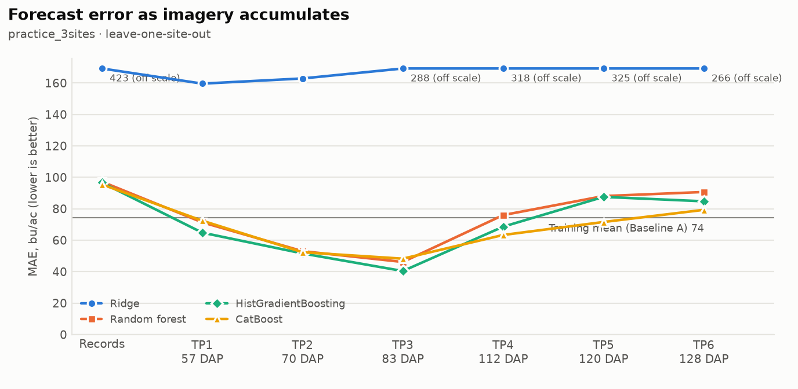
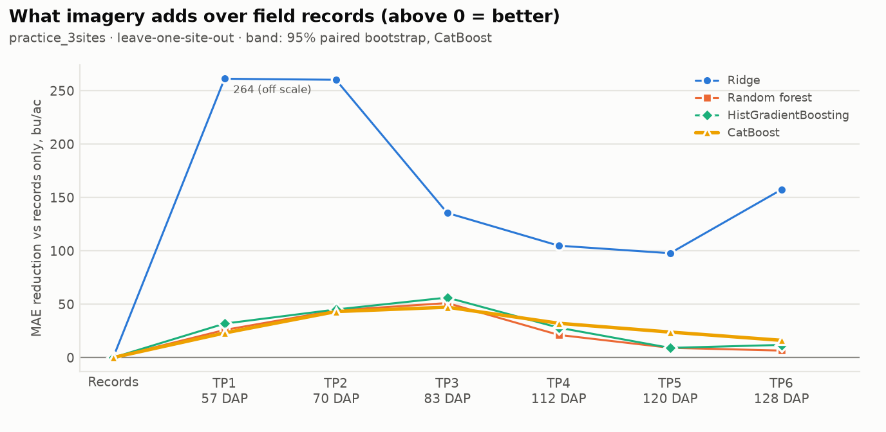
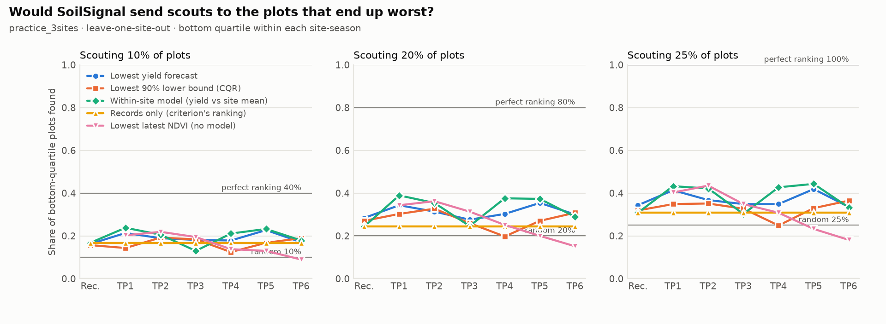
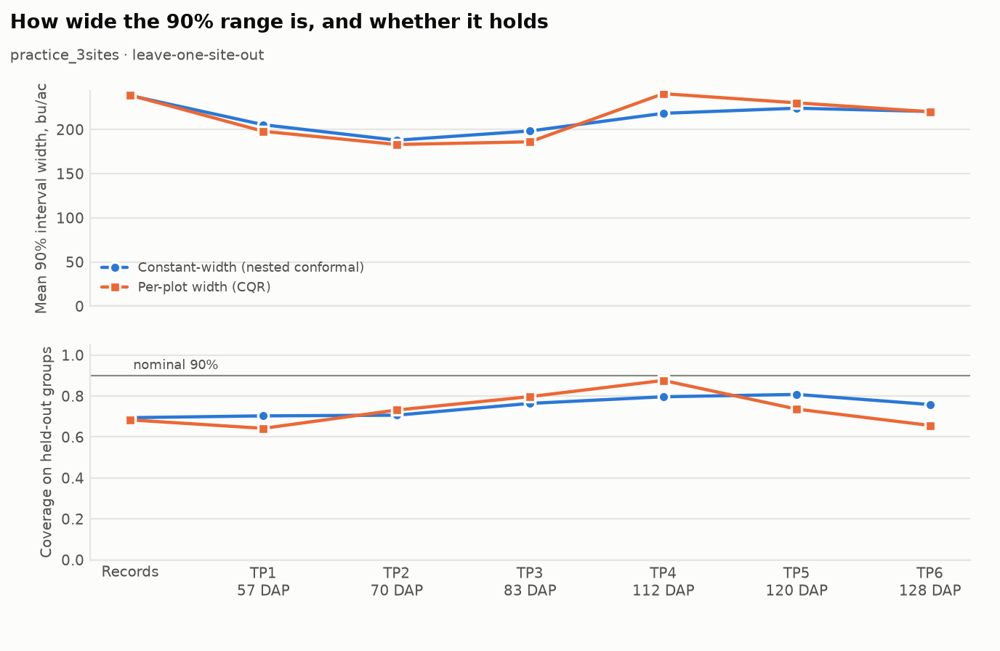
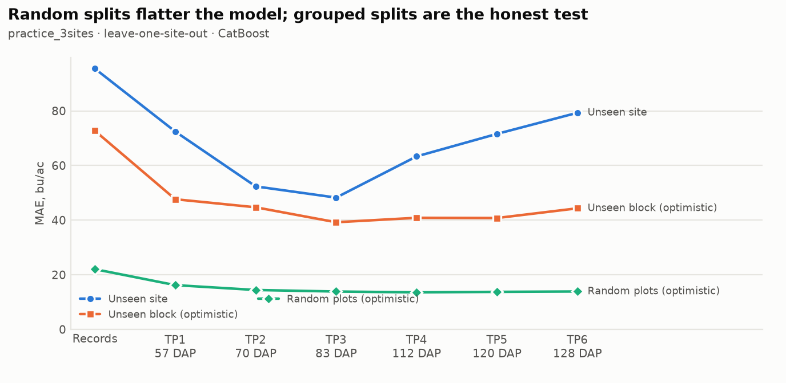

# Progressive early-signal experiment: practice_3sites

Generated 2026-09-26T08:47:54+00:00 (code `c0248ee-dirty`). 1479 plots,
sites Ames, Crawfordsville, Lincoln, season(s) 2022.

**Headline validation:** leave-one-site-out. **Primary model:**
CatBoost (same fixed hyperparameters at every stage). 90% intervals are nested conformal:
calibrated inside each training fold, scored on the held-out group.

## When does imagery start to help?

| Available information | Acquired | Median DAP | Passes | MAE | ΔMAE vs records (95% CI) | Better in | R² | Bias | Spearman (within site) | 90% coverage | Interval width | Recall @ 20% |
|---|---|---|---|---|---|---|---|---|---|---|---|---|
| Baseline A: training mean | – | – | – | 74.5 | – | – | -1.00 | +0.6 | – | 69% | 231 | – |
| Records only | – | – | 0.0 | 95.5 | reference | – | -1.90 | -37.7 | 0.18 | 69% | 238 | 28% |
| + TP1 | 2022-07-10 to 2022-07-18 | 57 | 1.0 | 72.4 | +23.0 (+24%; +22.1 to +23.9) | 3/3 | -0.72 | -16.2 | 0.34 | 70% | 205 | 34% |
| + TP1-TP2 | 2022-07-20 to 2022-08-06 | 70 | 2.0 | 52.3 | +43.1 (+45%; +41.9 to +44.4) | 3/3 | -0.04 | +6.0 | 0.25 | 71% | 188 | 31% |
| + TP1-TP3 | 2022-08-02 to 2022-09-03 | 83 | 3.0 | 48.2 | +47.2 (+49%; +46.0 to +48.4) | 3/3 | 0.08 | +1.7 | 0.18 | 76% | 198 | 28% |
| + TP1-TP4 | 2022-08-31 to 2022-09-13 | 112 | 4.0 | 63.3 | +32.1 (+34%; +31.0 to +33.3) | 3/3 | -0.43 | -9.9 | 0.22 | 80% | 218 | 30% |
| + TP1-TP5 | 2022-09-11 to 2022-10-01 | 120 | 5.0 | 71.6 | +23.9 (+25%; +22.9 to +24.9) | 3/3 | -0.67 | -19.4 | 0.36 | 81% | 224 | 35% |
| + TP1-TP6 | 2022-09-24 to 2022-10-09 | 128 | 6.0 | 79.3 | +16.2 (+17%; +15.2 to +17.1) | 3/3 | -1.01 | -23.1 | 0.25 | 76% | 220 | 30% |

ΔMAE is records-only MAE minus this stage's MAE (positive = imagery helped), same model,
same folds, same plots. The 95% interval resamples plots within site-seasons, so with few
sites it is narrower than the real between-site uncertainty; read it with "Better in"
(the held-out site-seasons where MAE fell). DAP = days after planting of the last pass
the stage can use; TP labels are not dates.

## Earliest useful forecast: the evidence

**No stage passes all five checks** with the current thresholds. Stages passing the accuracy checks (1 and 2): tp1, tp2, tp3, tp4, tp5, tp6.
Thresholds (configs/progressive.yaml): `{"min_mae_reduction_pct": 5.0, "require_ci_above_zero": true, "min_group_win_share": 0.67, "min_model_agreement": 0.75, "coverage_tolerance": 0.05, "min_group_coverage": 0.75, "scouting_budget": 0.2, "min_recall_gain": 0.05, "scouting_ranker": "relative_forecast", "min_lead_days": 30}`. This is evidence for
the team's call, not a verdict.

| Stage | 1 Beats records | 2 Consistent | 3 Calibrated | 4 Scouting | 5 Early | All |
|---|---|---|---|---|---|---|
| + TP1 | yes (+24%, CI low +22.1) | yes (100% groups, 100% models) | no (70% (worst 15%)) | yes (39% vs 24%) | yes (92 d lead) | no |
| + TP1-TP2 | yes (+45%, CI low +41.9) | yes (100% groups, 100% models) | no (71% (worst 14%)) | yes (35% vs 24%) | yes (84 d lead) | no |
| + TP1-TP3 | yes (+49%, CI low +46.0) | yes (100% groups, 100% models) | no (76% (worst 31%)) | no (25% vs 24%) | yes (66 d lead) | no |
| + TP1-TP4 | yes (+34%, CI low +31.0) | yes (100% groups, 100% models) | no (80% (worst 41%)) | yes (38% vs 24%) | yes (34 d lead) | no |
| + TP1-TP5 | yes (+25%, CI low +22.9) | yes (100% groups, 100% models) | no (81% (worst 44%)) | yes (37% vs 24%) | no (26 d lead) | no |
| + TP1-TP6 | yes (+17%, CI low +15.2) | yes (100% groups, 100% models) | no (76% (worst 32%)) | no (29% vs 24%) | no (18 d lead) | no |

## Scouting: if only X% of plots can be visited

Recall = share of each site-season's eventual bottom-quartile plots that the ranking sends
scouts to (pooled over site-seasons). The lower-bound ranking uses conformalized quantile
regression, whose width varies by plot; with a constant-width interval it would be the same
ranking as the forecast.

| Stage | Ranking | Recall @ 10% | Recall @ 20% | Recall @ 25% |
|---|---|---|---|---|
| Records only | Lowest yield forecast | 16% | 28% | 34% |
| Records only | Lowest 90% lower bound (CQR) | 16% | 27% | 32% |
| Records only | Within-site model (yield vs site mean) | 17% | 24% | 31% |
| Records only | Records only (criterion's ranking) | 17% | 24% | 31% |
| + TP1 | Lowest yield forecast | 21% | 34% | 41% |
| + TP1 | Lowest 90% lower bound (CQR) | 14% | 30% | 35% |
| + TP1 | Within-site model (yield vs site mean) | 24% | 39% | 43% |
| + TP1 | Lowest latest NDVI (no model) | 20% | 34% | 40% |
| + TP1-TP2 | Lowest yield forecast | 19% | 31% | 37% |
| + TP1-TP2 | Lowest 90% lower bound (CQR) | 19% | 33% | 35% |
| + TP1-TP2 | Within-site model (yield vs site mean) | 21% | 35% | 42% |
| + TP1-TP2 | Lowest latest NDVI (no model) | 22% | 36% | 44% |
| + TP1-TP3 | Lowest yield forecast | 18% | 28% | 35% |
| + TP1-TP3 | Lowest 90% lower bound (CQR) | 18% | 26% | 33% |
| + TP1-TP3 | Within-site model (yield vs site mean) | 13% | 25% | 30% |
| + TP1-TP3 | Lowest latest NDVI (no model) | 19% | 31% | 35% |
| + TP1-TP4 | Lowest yield forecast | 18% | 30% | 35% |
| + TP1-TP4 | Lowest 90% lower bound (CQR) | 12% | 20% | 25% |
| + TP1-TP4 | Within-site model (yield vs site mean) | 21% | 38% | 43% |
| + TP1-TP4 | Lowest latest NDVI (no model) | 14% | 25% | 31% |
| + TP1-TP5 | Lowest yield forecast | 23% | 35% | 42% |
| + TP1-TP5 | Lowest 90% lower bound (CQR) | 17% | 27% | 33% |
| + TP1-TP5 | Within-site model (yield vs site mean) | 23% | 37% | 44% |
| + TP1-TP5 | Lowest latest NDVI (no model) | 13% | 20% | 23% |
| + TP1-TP6 | Lowest yield forecast | 17% | 30% | 34% |
| + TP1-TP6 | Lowest 90% lower bound (CQR) | 19% | 31% | 36% |
| + TP1-TP6 | Within-site model (yield vs site mean) | 18% | 29% | 33% |
| + TP1-TP6 | Lowest latest NDVI (no model) | 9% | 15% | 18% |

Reference recall (10%: random 10%, perfect 40%, 20%: random 20%, perfect 80%, 25%: random 25%, perfect 100%).

## Uncertainty

## Why the headline is grouped (primary model MAE by validation scheme)

| Stage | site | field | random |
|---|---|---|---|
| Records only | 95.5 | 72.7 | 22.0 |
| + TP1 | 72.4 | 47.6 | 16.2 |
| + TP1-TP2 | 52.3 | 44.7 | 14.4 |
| + TP1-TP3 | 48.2 | 39.2 | 13.9 |
| + TP1-TP4 | 63.3 | 40.9 | 13.6 |
| + TP1-TP5 | 71.6 | 40.8 | 13.7 |
| + TP1-TP6 | 79.3 | 44.3 | 13.9 |

## Are errors spatially clustered?

| Stage | Median Moran's I of residuals | Site-seasons with p < 0.05 | Nearest-plot spacing (m) |
|---|---|---|---|
| Records only | 0.42 | 3/3 | 3.0 |
| + TP1 | 0.21 | 3/3 | 3.0 |
| + TP1-TP2 | 0.25 | 3/3 | 3.0 |
| + TP1-TP3 | 0.35 | 3/3 | 3.0 |
| + TP1-TP4 | 0.41 | 3/3 | 3.0 |
| + TP1-TP5 | 0.32 | 3/3 | 3.0 |
| + TP1-TP6 | 0.32 | 3/3 | 3.0 |

## Acquisition timing by site-season

| Stage | Site-season | Last pass | Date | Median DAP | Lead to harvest (d) |
|---|---|---|---|---|---|
| + TP1 | Ames 2022 | TP1 | 2022-07-15 | 54 | 92 |
| + TP1 | Crawfordsville 2022 | TP1 | 2022-07-10 | 60 | 97 |
| + TP1 | Lincoln 2022 | TP1 | 2022-07-18 | 57 | 89 |
| + TP1-TP2 | Ames 2022 | TP2 | 2022-07-23 | 62 | 84 |
| + TP1-TP2 | Crawfordsville 2022 | TP2 | 2022-07-20 | 70 | 87 |
| + TP1-TP2 | Lincoln 2022 | TP2 | 2022-08-06 | 76 | 70 |
| + TP1-TP3 | Ames 2022 | TP3 | 2022-08-10 | 80 | 66 |
| + TP1-TP3 | Crawfordsville 2022 | TP3 | 2022-08-02 | 83 | 74 |
| + TP1-TP3 | Lincoln 2022 | TP3 | 2022-09-03 | 104 | 42 |
| + TP1-TP4 | Ames 2022 | TP4 | 2022-08-31 | 101 | 45 |
| + TP1-TP4 | Crawfordsville 2022 | TP4 | 2022-09-13 | 125 | 32 |
| + TP1-TP4 | Lincoln 2022 | TP4 | 2022-09-11 | 112 | 34 |
| + TP1-TP5 | Ames 2022 | TP5 | 2022-09-11 | 112 | 34 |
| + TP1-TP5 | Crawfordsville 2022 | TP5 | 2022-10-01 | 143 | 14 |
| + TP1-TP5 | Lincoln 2022 | TP5 | 2022-09-19 | 120 | 26 |
| + TP1-TP6 | Ames 2022 | TP6 | 2022-09-24 | 125 | 21 |
| + TP1-TP6 | Crawfordsville 2022 | TP6 | 2022-10-09 | 151 | 6 |
| + TP1-TP6 | Lincoln 2022 | TP6 | 2022-09-27 | 128 | 18 |

## Validation schemes

- `temporal`: not run (only one labelled season (2022))
- `site`: ran (3 groups)
- `year`: not run (only one year (1))
- `site_year`: not run (one season: identical to leave-one-site-out)
- `field`: ran (7 groups)
- `random`: ran (5 folds)

## Notes and limitations

- restricted to sites: Ames, Crawfordsville, Lincoln
- temporal validation not run: only one labelled season (2022)
- year validation not run: only one year (1)
- site_year validation not run: one season: identical to leave-one-site-out

