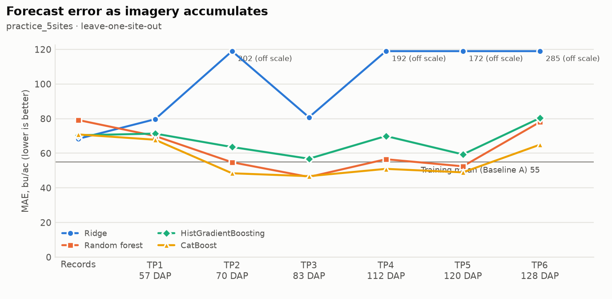
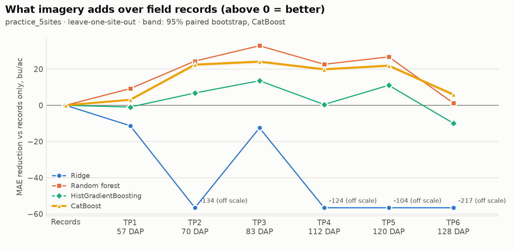
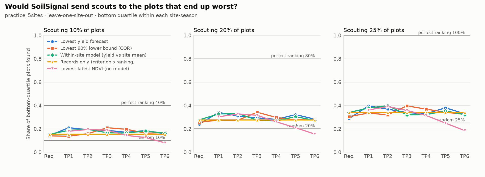
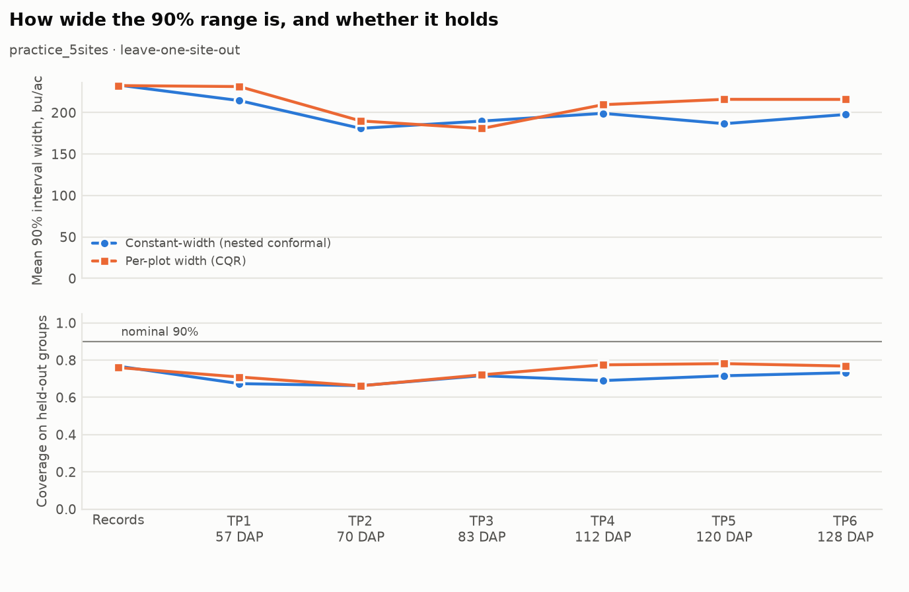
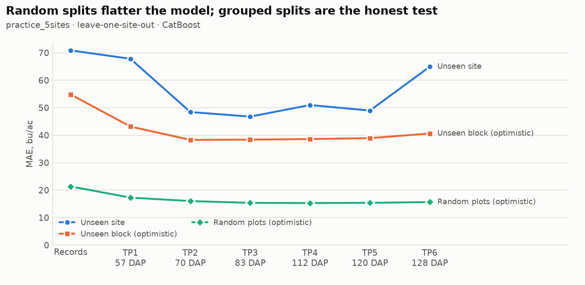

# Progressive early-signal experiment: practice_5sites

Generated 2026-09-26T09:03:58+00:00 (code `c0248ee-dirty`). 2131 plots,
sites Ames, Crawfordsville, Lincoln, MOValley, Scottsbluff, season(s) 2022.

**Headline validation:** leave-one-site-out. **Primary model:**
CatBoost (same fixed hyperparameters at every stage). 90% intervals are nested conformal:
calibrated inside each training fold, scored on the held-out group.

## When does imagery start to help?

| Available information | Acquired | Median DAP | Passes | MAE | ΔMAE vs records (95% CI) | Better in | R² | Bias | Spearman (within site) | 90% coverage | Interval width | Recall @ 20% |
|---|---|---|---|---|---|---|---|---|---|---|---|---|
| Baseline A: training mean | – | – | – | 55.1 | – | – | -0.50 | +0.7 | – | 75% | 197 | – |
| Records only | – | – | 0.0 | 70.9 | reference | – | -1.25 | -24.1 | 0.21 | 77% | 233 | 24% |
| + TP1 | 2022-07-04 to 2022-07-18 | 57 | 1.0 | 67.8 | +3.1 (+4%; +2.3 to +3.9) | 4/5 | -1.12 | -25.9 | 0.29 | 67% | 215 | 34% |
| + TP1-TP2 | 2022-07-17 to 2022-08-06 | 70 | 2.0 | 48.4 | +22.4 (+32%; +21.3 to +23.5) | 4/5 | -0.14 | -5.9 | 0.24 | 66% | 181 | 31% |
| + TP1-TP3 | 2022-08-02 to 2022-09-03 | 83 | 3.0 | 46.8 | +24.1 (+34%; +23.1 to +25.1) | 4/5 | -0.12 | -4.1 | 0.22 | 72% | 190 | 29% |
| + TP1-TP4 | 2022-08-18 to 2022-09-13 | 112 | 4.0 | 51.0 | +19.9 (+28%; +19.1 to +20.7) | 5/5 | -0.36 | -7.7 | 0.20 | 69% | 199 | 28% |
| + TP1-TP5 | 2022-09-09 to 2022-10-01 | 120 | 5.0 | 49.0 | +21.9 (+31%; +21.0 to +22.8) | 5/5 | -0.23 | -3.5 | 0.29 | 72% | 187 | 32% |
| + TP1-TP6 | 2022-09-19 to 2022-10-09 | 128 | 6.0 | 64.9 | +5.9 (+8%; +5.0 to +6.9) | 3/5 | -0.75 | -23.0 | 0.20 | 73% | 198 | 28% |

ΔMAE is records-only MAE minus this stage's MAE (positive = imagery helped), same model,
same folds, same plots. The 95% interval resamples plots within site-seasons, so with few
sites it is narrower than the real between-site uncertainty; read it with "Better in"
(the held-out site-seasons where MAE fell). DAP = days after planting of the last pass
the stage can use; TP labels are not dates.

## Earliest useful forecast: the evidence

**No stage passes all five checks** with the current thresholds. Stages passing the accuracy checks (1 and 2): tp2, tp3, tp4, tp5.
Thresholds (configs/progressive.yaml): `{"min_mae_reduction_pct": 5.0, "require_ci_above_zero": true, "min_group_win_share": 0.67, "min_model_agreement": 0.75, "coverage_tolerance": 0.05, "min_group_coverage": 0.75, "scouting_budget": 0.2, "min_recall_gain": 0.05, "scouting_ranker": "relative_forecast", "min_lead_days": 30}`. This is evidence for
the team's call, not a verdict.

| Stage | 1 Beats records | 2 Consistent | 3 Calibrated | 4 Scouting | 5 Early | All |
|---|---|---|---|---|---|---|
| + TP1 | no (+4%, CI low +2.3) | no (80% groups, 50% models) | no (67% (worst 10%)) | yes (33% vs 28%) | yes (94 d lead) | no |
| + TP1-TP2 | yes (+32%, CI low +21.3) | yes (80% groups, 75% models) | no (66% (worst 8%)) | yes (33% vs 28%) | yes (86 d lead) | no |
| + TP1-TP3 | yes (+34%, CI low +23.1) | yes (80% groups, 75% models) | no (72% (worst 22%)) | no (28% vs 28%) | yes (68 d lead) | no |
| + TP1-TP4 | yes (+28%, CI low +19.1) | yes (100% groups, 75% models) | no (69% (worst 20%)) | no (27% vs 28%) | yes (42 d lead) | no |
| + TP1-TP5 | yes (+31%, CI low +21.0) | yes (100% groups, 75% models) | no (72% (worst 7%)) | no (31% vs 28%) | yes (34 d lead) | no |
| + TP1-TP6 | yes (+8%, CI low +5.0) | no (60% groups, 50% models) | no (73% (worst 5%)) | no (27% vs 28%) | no (21 d lead) | no |

## Scouting: if only X% of plots can be visited

Recall = share of each site-season's eventual bottom-quartile plots that the ranking sends
scouts to (pooled over site-seasons). The lower-bound ranking uses conformalized quantile
regression, whose width varies by plot; with a constant-width interval it would be the same
ranking as the forecast.

| Stage | Ranking | Recall @ 10% | Recall @ 20% | Recall @ 25% |
|---|---|---|---|---|
| Records only | Lowest yield forecast | 14% | 24% | 29% |
| Records only | Lowest 90% lower bound (CQR) | 14% | 26% | 31% |
| Records only | Within-site model (yield vs site mean) | 15% | 28% | 34% |
| Records only | Records only (criterion's ranking) | 15% | 28% | 34% |
| + TP1 | Lowest yield forecast | 21% | 34% | 40% |
| + TP1 | Lowest 90% lower bound (CQR) | 14% | 28% | 34% |
| + TP1 | Within-site model (yield vs site mean) | 19% | 33% | 38% |
| + TP1 | Lowest latest NDVI (no model) | 18% | 30% | 36% |
| + TP1-TP2 | Lowest yield forecast | 19% | 31% | 37% |
| + TP1-TP2 | Lowest 90% lower bound (CQR) | 16% | 27% | 32% |
| + TP1-TP2 | Within-site model (yield vs site mean) | 20% | 33% | 40% |
| + TP1-TP2 | Lowest latest NDVI (no model) | 19% | 33% | 39% |
| + TP1-TP3 | Lowest yield forecast | 19% | 29% | 34% |
| + TP1-TP3 | Lowest 90% lower bound (CQR) | 21% | 34% | 40% |
| + TP1-TP3 | Within-site model (yield vs site mean) | 17% | 28% | 32% |
| + TP1-TP3 | Lowest latest NDVI (no model) | 19% | 32% | 36% |
| + TP1-TP4 | Lowest yield forecast | 17% | 28% | 33% |
| + TP1-TP4 | Lowest 90% lower bound (CQR) | 20% | 30% | 37% |
| + TP1-TP4 | Within-site model (yield vs site mean) | 16% | 27% | 32% |
| + TP1-TP4 | Lowest latest NDVI (no model) | 14% | 26% | 31% |
| + TP1-TP5 | Lowest yield forecast | 19% | 32% | 38% |
| + TP1-TP5 | Lowest 90% lower bound (CQR) | 16% | 28% | 34% |
| + TP1-TP5 | Within-site model (yield vs site mean) | 18% | 31% | 35% |
| + TP1-TP5 | Lowest latest NDVI (no model) | 13% | 21% | 25% |
| + TP1-TP6 | Lowest yield forecast | 16% | 28% | 33% |
| + TP1-TP6 | Lowest 90% lower bound (CQR) | 17% | 28% | 32% |
| + TP1-TP6 | Within-site model (yield vs site mean) | 16% | 27% | 32% |
| + TP1-TP6 | Lowest latest NDVI (no model) | 8% | 16% | 19% |

Reference recall (10%: random 10%, perfect 40%, 20%: random 20%, perfect 80%, 25%: random 25%, perfect 100%).

## Uncertainty

## Why the headline is grouped (primary model MAE by validation scheme)

| Stage | site | field | random |
|---|---|---|---|
| Records only | 70.9 | 54.9 | 21.4 |
| + TP1 | 67.8 | 43.2 | 17.3 |
| + TP1-TP2 | 48.4 | 38.3 | 16.0 |
| + TP1-TP3 | 46.8 | 38.4 | 15.4 |
| + TP1-TP4 | 51.0 | 38.6 | 15.3 |
| + TP1-TP5 | 49.0 | 38.9 | 15.4 |
| + TP1-TP6 | 64.9 | 40.6 | 15.7 |

## Are errors spatially clustered?

| Stage | Median Moran's I of residuals | Site-seasons with p < 0.05 | Nearest-plot spacing (m) |
|---|---|---|---|
| Records only | 0.31 | 5/5 | 3.0 |
| + TP1 | 0.30 | 5/5 | 3.0 |
| + TP1-TP2 | 0.42 | 5/5 | 3.0 |
| + TP1-TP3 | 0.41 | 5/5 | 3.0 |
| + TP1-TP4 | 0.39 | 5/5 | 3.0 |
| + TP1-TP5 | 0.33 | 5/5 | 3.0 |
| + TP1-TP6 | 0.34 | 5/5 | 3.0 |

## Acquisition timing by site-season

| Stage | Site-season | Last pass | Date | Median DAP | Lead to harvest (d) |
|---|---|---|---|---|---|
| + TP1 | Ames 2022 | TP1 | 2022-07-15 | 54 | 92 |
| + TP1 | Crawfordsville 2022 | TP1 | 2022-07-10 | 60 | 97 |
| + TP1 | Lincoln 2022 | TP1 | 2022-07-18 | 57 | 89 |
| + TP1 | MOValley 2022 | TP1 | 2022-07-13 | 75 | 94 |
| + TP1 | Scottsbluff 2022 | TP1 | 2022-07-04 | 46 | 103 |
| + TP1-TP2 | Ames 2022 | TP2 | 2022-07-23 | 62 | 84 |
| + TP1-TP2 | Crawfordsville 2022 | TP2 | 2022-07-20 | 70 | 87 |
| + TP1-TP2 | Lincoln 2022 | TP2 | 2022-08-06 | 76 | 70 |
| + TP1-TP2 | MOValley 2022 | TP2 | 2022-07-21 | 83 | 86 |
| + TP1-TP2 | Scottsbluff 2022 | TP2 | 2022-07-17 | 59 | 90 |
| + TP1-TP3 | Ames 2022 | TP3 | 2022-08-10 | 80 | 66 |
| + TP1-TP3 | Crawfordsville 2022 | TP3 | 2022-08-02 | 83 | 74 |
| + TP1-TP3 | Lincoln 2022 | TP3 | 2022-09-03 | 104 | 42 |
| + TP1-TP3 | MOValley 2022 | TP3 | 2022-08-08 | 101 | 68 |
| + TP1-TP3 | Scottsbluff 2022 | TP3 | 2022-08-07 | 80 | 69 |
| + TP1-TP4 | Ames 2022 | TP4 | 2022-08-31 | 101 | 45 |
| + TP1-TP4 | Crawfordsville 2022 | TP4 | 2022-09-13 | 125 | 32 |
| + TP1-TP4 | Lincoln 2022 | TP4 | 2022-09-11 | 112 | 34 |
| + TP1-TP4 | MOValley 2022 | TP4 | 2022-09-03 | 127 | 42 |
| + TP1-TP4 | Scottsbluff 2022 | TP4 | 2022-08-18 | 91 | 58 |
| + TP1-TP5 | Ames 2022 | TP5 | 2022-09-11 | 112 | 34 |
| + TP1-TP5 | Crawfordsville 2022 | TP5 | 2022-10-01 | 143 | 14 |
| + TP1-TP5 | Lincoln 2022 | TP5 | 2022-09-19 | 120 | 26 |
| + TP1-TP5 | MOValley 2022 | TP5 | 2022-09-11 | 135 | 34 |
| + TP1-TP5 | Scottsbluff 2022 | TP5 | 2022-09-09 | 113 | 36 |
| + TP1-TP6 | Ames 2022 | TP6 | 2022-09-24 | 125 | 21 |
| + TP1-TP6 | Crawfordsville 2022 | TP6 | 2022-10-09 | 151 | 6 |
| + TP1-TP6 | Lincoln 2022 | TP6 | 2022-09-27 | 128 | 18 |
| + TP1-TP6 | MOValley 2022 | TP6 | 2022-09-19 | 143 | 26 |
| + TP1-TP6 | Scottsbluff 2022 | TP6 | 2022-09-24 | 128 | 21 |

## Validation schemes

- `temporal`: not run (only one labelled season (2022))
- `site`: ran (5 groups)
- `year`: not run (only one year (1))
- `site_year`: not run (one season: identical to leave-one-site-out)
- `field`: ran (11 groups)
- `random`: ran (5 folds)

## Notes and limitations

- temporal validation not run: only one labelled season (2022)
- year validation not run: only one year (1)
- site_year validation not run: one season: identical to leave-one-site-out

