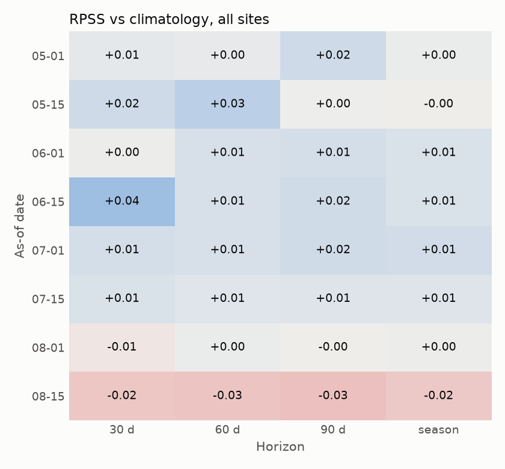
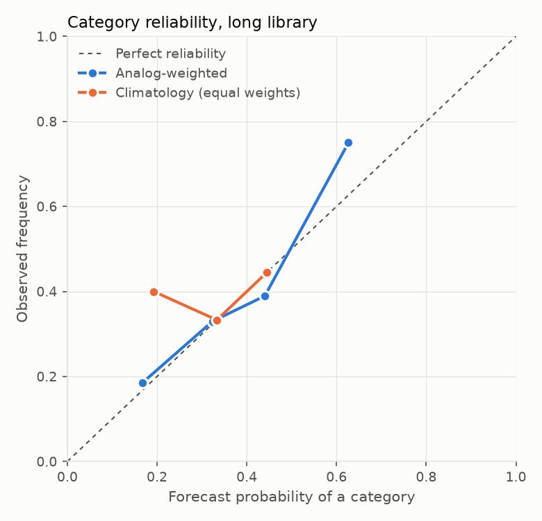

# Weather outlook backtest: `long` library

Generated by `python -m soilsignal_ml.weather_outlook backtest --library long`. Method: `ml/research/weather_outlook.md`.

Seasons per site: Ames 27, Crawfordsville 31, Lincoln 31, MOValley 28, Scottsbluff 31.

Each case pretends one season is the current one, builds the outlook from the other seasons (the engine never lets a season be its own analog and reads the current season only through the as-of date), and scores it against what that season did. The reference is the same outlook with every season weighted equally (climatology), so skill measures the analog weighting alone.

## Overall

- Cases: 4736 (148 site-seasons x 8 as-of dates x 4 horizons); favorable/typical/adverse formed in 4736.

- Ranked probability score: analog 0.2197, climatology 0.2210; **RPSS +0.006** (90% interval over seasons -0.008 to +0.021).
- Brier score: analog 0.6663, climatology 0.6670 (BSS +0.001).
- Most likely category correct: analog 36.4%, climatology 33.3% (chance is about 33%).
- Mean effective sample size: 21.6 seasons.

Continuous horizon outcomes (CRPSS vs equal weights; 90% interval over seasons):

- `precip_mm`: -0.009 (-0.018 to -0.001)
- `gdd`: -0.005 (-0.013 to +0.003)
- `kdd_29c`: +0.017 (+0.003 to +0.033)
- `heat_days`: +0.027 (+0.010 to +0.045)
- `water_deficit_mm`: -0.006 (-0.015 to +0.003)

## By as-of date and horizon (all sites)

| as_of | horizon | cases | mean_ess | rpss | bss | accuracy | accuracy_clim | crpss_precip_mm | crpss_gdd | crpss_water_deficit_mm |
|---|---|---|---|---|---|---|---|---|---|---|
| 05-01 | 30 | 148 | 20.8 | 0.005 | -0.002 | 0.338 | 0.288 | -0.016 | -0.023 | -0.023 |
| 05-15 | 30 | 148 | 21.7 | 0.017 | 0.018 | 0.446 | 0.354 | -0.015 | -0.001 | 0 |
| 06-01 | 30 | 148 | 21.2 | 0.002 | 0.002 | 0.331 | 0.333 | -0.008 | -0.013 | -0.006 |
| 06-15 | 30 | 148 | 22.6 | 0.041 | 0.023 | 0.473 | 0.333 | 0.004 | -0.013 | 0.007 |
| 07-01 | 30 | 148 | 22.3 | 0.014 | 0.001 | 0.331 | 0.333 | 0.003 | -0.002 | 0.011 |
| 07-15 | 30 | 148 | 22 | 0.011 | 0.003 | 0.351 | 0.338 | -0.016 | 0.004 | -0.01 |
| 08-01 | 30 | 148 | 21.1 | -0.006 | -0.004 | 0.304 | 0.342 | -0.005 | -0.006 | -0.006 |
| 08-15 | 30 | 148 | 21.4 | -0.024 | -0.022 | 0.324 | 0.33 | -0.027 | -0.029 | -0.027 |
| 05-01 | 60 | 148 | 20.8 | 0.004 | -0.007 | 0.338 | 0.333 | -0.016 | 0.001 | -0.022 |
| 05-15 | 60 | 148 | 21.7 | 0.026 | 0.018 | 0.372 | 0.333 | -0.018 | 0.002 | -0.011 |
| 06-01 | 60 | 148 | 21.2 | 0.012 | -0.006 | 0.351 | 0.338 | -0.001 | -0.013 | 0.008 |
| 06-15 | 60 | 148 | 22.6 | 0.012 | 0.006 | 0.297 | 0.333 | 0.003 | -0.004 | 0.006 |
| 07-01 | 60 | 148 | 22.3 | 0.012 | 0.007 | 0.405 | 0.337 | 0.012 | 0.006 | 0.012 |
| 07-15 | 60 | 148 | 22 | 0.008 | -0.008 | 0.324 | 0.33 | -0.008 | 0.007 | -0.002 |
| 08-01 | 60 | 148 | 21.1 | 0.003 | 0.009 | 0.392 | 0.33 | -0.011 | 0.022 | -0.009 |
| 08-15 | 60 | 148 | 21.4 | -0.025 | -0.006 | 0.405 | 0.338 | -0.016 | -0.022 | -0.015 |
| 05-01 | 90 | 148 | 20.8 | 0.017 | 0.016 | 0.453 | 0.333 | -0.022 | 0.001 | -0.022 |
| 05-15 | 90 | 148 | 21.7 | 0.001 | -0.012 | 0.351 | 0.333 | -0.021 | -0.006 | -0.004 |
| 06-01 | 90 | 148 | 21.2 | 0.014 | 0.006 | 0.358 | 0.33 | 0.006 | -0.01 | 0.008 |
| 06-15 | 90 | 148 | 22.6 | 0.016 | 0.005 | 0.311 | 0.331 | -0.003 | -0.013 | -0.003 |
| 07-01 | 90 | 148 | 22.3 | 0.016 | 0.009 | 0.378 | 0.33 | 0.023 | 0.013 | 0.021 |
| 07-15 | 90 | 148 | 22 | 0.009 | -0.006 | 0.331 | 0.33 | -0.009 | 0.006 | -0.004 |
| 08-01 | 90 | 148 | 21.1 | -0.001 | -0.002 | 0.358 | 0.328 | -0.014 | 0.038 | -0.015 |
| 08-15 | 90 | 148 | 21.4 | -0.028 | -0.01 | 0.392 | 0.341 | -0.029 | -0.005 | -0.027 |
| 05-01 | season | 148 | 20.8 | 0.003 | -0.003 | 0.358 | 0.337 | -0.027 | -0.028 | -0.029 |
| 05-15 | season | 148 | 21.7 | -0.001 | -0.002 | 0.392 | 0.333 | -0.025 | -0.018 | -0.02 |
| 06-01 | season | 148 | 21.2 | 0.011 | -0.002 | 0.358 | 0.333 | -0.01 | -0.029 | -0.006 |
| 06-15 | season | 148 | 22.6 | 0.011 | 0.004 | 0.318 | 0.34 | -0.006 | -0.024 | -0.006 |
| 07-01 | season | 148 | 22.3 | 0.015 | 0.008 | 0.385 | 0.327 | 0.025 | -0.003 | 0.027 |
| 07-15 | season | 148 | 22 | 0.009 | -0.006 | 0.331 | 0.33 | -0.013 | 0.005 | -0.006 |
| 08-01 | season | 148 | 21.1 | 0.002 | 0.002 | 0.392 | 0.328 | -0.012 | 0.023 | -0.01 |
| 08-15 | season | 148 | 21.4 | -0.023 | -0.003 | 0.405 | 0.338 | -0.016 | -0.019 | -0.014 |

## By site and horizon (all as-of dates)

| site | horizon | cases | seasons | mean_ess | rpss | bss | accuracy | accuracy_clim |
|---|---|---|---|---|---|---|---|---|
| Ames | 30 | 216 | 27 | 18.9 | -0.029 | -0.023 | 0.306 | 0.345 |
| Ames | 60 | 216 | 27 | 18.9 | -0.05 | -0.039 | 0.273 | 0.331 |
| Ames | 90 | 216 | 27 | 18.9 | -0.03 | -0.022 | 0.333 | 0.326 |
| Ames | season | 216 | 27 | 18.9 | -0.034 | -0.023 | 0.329 | 0.331 |
| Crawfordsville | 30 | 248 | 31 | 23.1 | -0.016 | -0.014 | 0.343 | 0.333 |
| Crawfordsville | 60 | 248 | 31 | 23.1 | -0.011 | -0.012 | 0.339 | 0.333 |
| Crawfordsville | 90 | 248 | 31 | 23.1 | -0.016 | -0.016 | 0.306 | 0.333 |
| Crawfordsville | season | 248 | 31 | 23.1 | -0.019 | -0.014 | 0.323 | 0.333 |
| Lincoln | 30 | 248 | 31 | 22.5 | 0.008 | 0.007 | 0.379 | 0.333 |
| Lincoln | 60 | 248 | 31 | 22.5 | -0.015 | -0.015 | 0.339 | 0.333 |
| Lincoln | 90 | 248 | 31 | 22.5 | -0.029 | -0.032 | 0.306 | 0.333 |
| Lincoln | season | 248 | 31 | 22.5 | -0.03 | -0.036 | 0.302 | 0.333 |
| MOValley | 30 | 224 | 28 | 20 | -0.011 | -0.007 | 0.366 | 0.333 |
| MOValley | 60 | 224 | 28 | 20 | -0.006 | -0.005 | 0.357 | 0.333 |
| MOValley | 90 | 224 | 28 | 20 | -0.003 | -0.001 | 0.375 | 0.333 |
| MOValley | season | 224 | 28 | 20 | -0.001 | -0.002 | 0.393 | 0.333 |
| Scottsbluff | 30 | 248 | 31 | 23.2 | 0.08 | 0.045 | 0.411 | 0.315 |
| Scottsbluff | 60 | 248 | 31 | 23.2 | 0.106 | 0.073 | 0.484 | 0.339 |
| Scottsbluff | 90 | 248 | 31 | 23.2 | 0.098 | 0.072 | 0.508 | 0.333 |
| Scottsbluff | season | 248 | 31 | 23.2 | 0.096 | 0.07 | 0.488 | 0.335 |

## Reliability (pooled categories)

analog:

| bin | forecast | observed | n |
|---|---|---|---|
| (-0.001, 0.2] | 0.167 | 0.185 | 314 |
| (0.2, 0.4] | 0.323 | 0.33 | 12280 |
| (0.4, 0.6] | 0.44 | 0.389 | 1610 |
| (0.6, 0.8] | 0.627 | 0.75 | 4 |

climatology:

| bin | forecast | observed | n |
|---|---|---|---|
| (-0.001, 0.2] | 0.192 | 0.4 | 15 |
| (0.2, 0.4] | 0.333 | 0.333 | 14166 |
| (0.4, 0.6] | 0.444 | 0.444 | 27 |

Per-case rows: `cases.csv`; per site x as-of x horizon: `summary.csv`.

