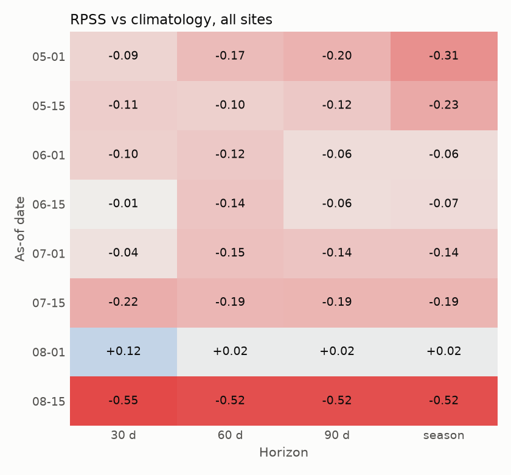
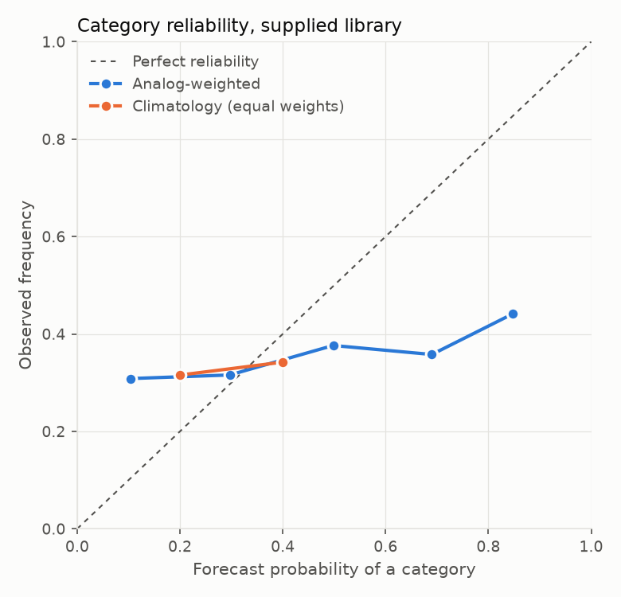

# Weather outlook backtest: `supplied` library

Generated by `python -m soilsignal_ml.weather_outlook backtest --library supplied`. Method: `ml/research/weather_outlook.md`.

> **Exploratory.** 6 seasons per site. Each leave-one-season-out outlook rests on one season fewer (5 analogs), and tercile categories over five seasons can only be 40/20/40 or similar. Treat every number here as a check that the pipeline runs, not as evidence of skill.

Seasons per site: Ames 6, Crawfordsville 6, Lincoln 6, MOValley 6, Scottsbluff 6.

Each case pretends one season is the current one, builds the outlook from the other seasons (the engine never lets a season be its own analog and reads the current season only through the as-of date), and scores it against what that season did. The reference is the same outlook with every season weighted equally (climatology), so skill measures the analog weighting alone.

## Overall

- Cases: 960 (30 site-seasons x 8 as-of dates x 4 horizons); favorable/typical/adverse formed in 960.

- Ranked probability score: analog 0.2652, climatology 0.2286; **RPSS -0.160** (90% interval over seasons -0.232 to -0.088).
- Brier score: analog 0.7850, climatology 0.6863 (BSS -0.144).
- Most likely category correct: analog 36.7%, climatology 34.2% (chance is about 33%).
- Mean effective sample size: 3.1 seasons.

Continuous horizon outcomes (CRPSS vs equal weights; 90% interval over seasons):

- `precip_mm`: -0.067 (-0.124 to -0.015)
- `gdd`: -0.147 (-0.207 to -0.091)
- `kdd_29c`: -0.088 (-0.156 to -0.024)
- `heat_days`: -0.100 (-0.172 to -0.036)
- `water_deficit_mm`: -0.059 (-0.120 to -0.003)

## By as-of date and horizon (all sites)

| as_of | horizon | cases | mean_ess | rpss | bss | accuracy | accuracy_clim | crpss_precip_mm | crpss_gdd | crpss_water_deficit_mm |
|---|---|---|---|---|---|---|---|---|---|---|
| 05-01 | 30 | 30 | 3.2 | -0.088 | -0.067 | 0.4 | 0.333 | -0.259 | -0.135 | -0.195 |
| 05-15 | 30 | 30 | 3.1 | -0.108 | -0.212 | 0.3 | 0.333 | 0.034 | -0.212 | 0.037 |
| 06-01 | 30 | 30 | 3.2 | -0.099 | -0.054 | 0.433 | 0.333 | -0.098 | -0.177 | -0.086 |
| 06-15 | 30 | 30 | 3 | -0.005 | 0.032 | 0.467 | 0.317 | 0.037 | -0.122 | 0.01 |
| 07-01 | 30 | 30 | 3.1 | -0.045 | -0.029 | 0.5 | 0.367 | -0.115 | 0.084 | -0.056 |
| 07-15 | 30 | 30 | 3.3 | -0.218 | -0.116 | 0.4 | 0.367 | -0.1 | -0.019 | -0.091 |
| 08-01 | 30 | 30 | 3 | 0.122 | 0.034 | 0.533 | 0.333 | 0.162 | -0.082 | 0.116 |
| 08-15 | 30 | 30 | 2.8 | -0.548 | -0.365 | 0.1 | 0.317 | -0.058 | -0.201 | -0.067 |
| 05-01 | 60 | 30 | 3.2 | -0.17 | -0.178 | 0.333 | 0.333 | -0.073 | -0.1 | -0.057 |
| 05-15 | 60 | 30 | 3.1 | -0.1 | -0.133 | 0.467 | 0.35 | 0.215 | -0.191 | 0.24 |
| 06-01 | 60 | 30 | 3.2 | -0.125 | -0.105 | 0.433 | 0.333 | 0.011 | -0.118 | 0.033 |
| 06-15 | 60 | 30 | 3 | -0.141 | -0.186 | 0.4 | 0.317 | -0.132 | 0.06 | -0.147 |
| 07-01 | 60 | 30 | 3.1 | -0.153 | -0.161 | 0.367 | 0.35 | -0.048 | -0.01 | -0.05 |
| 07-15 | 60 | 30 | 3.3 | -0.187 | -0.157 | 0.367 | 0.383 | -0.009 | -0.239 | -0.001 |
| 08-01 | 60 | 30 | 3 | 0.016 | -0.054 | 0.533 | 0.333 | -0.018 | -0.278 | -0.032 |
| 08-15 | 60 | 30 | 2.8 | -0.524 | -0.338 | 0.1 | 0.317 | -0.125 | -0.253 | -0.136 |
| 05-01 | 90 | 30 | 3.2 | -0.197 | -0.138 | 0.367 | 0.333 | -0.109 | 0.025 | -0.038 |
| 05-15 | 90 | 30 | 3.1 | -0.125 | -0.143 | 0.233 | 0.317 | 0.14 | -0.124 | 0.144 |
| 06-01 | 90 | 30 | 3.2 | -0.061 | -0.057 | 0.467 | 0.367 | -0.083 | -0.049 | -0.059 |
| 06-15 | 90 | 30 | 3 | -0.056 | -0.074 | 0.433 | 0.367 | 0.023 | -0.019 | 0.003 |
| 07-01 | 90 | 30 | 3.1 | -0.141 | -0.159 | 0.367 | 0.35 | -0.138 | -0.049 | -0.123 |
| 07-15 | 90 | 30 | 3.3 | -0.189 | -0.163 | 0.367 | 0.383 | -0.063 | -0.203 | -0.064 |
| 08-01 | 90 | 30 | 3 | 0.016 | -0.054 | 0.533 | 0.333 | 0.004 | -0.268 | -0.012 |
| 08-15 | 90 | 30 | 2.8 | -0.524 | -0.338 | 0.1 | 0.317 | -0.221 | -0.197 | -0.23 |
| 05-01 | season | 30 | 3.2 | -0.309 | -0.261 | 0.333 | 0.333 | -0.172 | -0.19 | -0.144 |
| 05-15 | season | 30 | 3.1 | -0.228 | -0.246 | 0.133 | 0.317 | -0.061 | -0.098 | -0.027 |
| 06-01 | season | 30 | 3.2 | -0.061 | -0.057 | 0.467 | 0.367 | -0.149 | -0.073 | -0.137 |
| 06-15 | season | 30 | 3 | -0.067 | -0.083 | 0.433 | 0.367 | -0.068 | -0.119 | -0.068 |
| 07-01 | season | 30 | 3.1 | -0.141 | -0.159 | 0.367 | 0.35 | -0.157 | -0.15 | -0.14 |
| 07-15 | season | 30 | 3.3 | -0.189 | -0.163 | 0.367 | 0.383 | -0.064 | -0.204 | -0.067 |
| 08-01 | season | 30 | 3 | 0.016 | -0.054 | 0.533 | 0.333 | -0.02 | -0.247 | -0.039 |
| 08-15 | season | 30 | 2.8 | -0.524 | -0.338 | 0.1 | 0.317 | -0.125 | -0.26 | -0.135 |

## By site and horizon (all as-of dates)

| site | horizon | cases | seasons | mean_ess | rpss | bss | accuracy | accuracy_clim |
|---|---|---|---|---|---|---|---|---|
| Ames | 30 | 48 | 6 | 3.1 | 0.041 | 0.066 | 0.5 | 0.344 |
| Ames | 60 | 48 | 6 | 3.1 | -0.116 | -0.169 | 0.396 | 0.344 |
| Ames | 90 | 48 | 6 | 3.1 | -0.177 | -0.167 | 0.292 | 0.344 |
| Ames | season | 48 | 6 | 3.1 | -0.242 | -0.242 | 0.271 | 0.344 |
| Crawfordsville | 30 | 48 | 6 | 3 | -0.112 | -0.109 | 0.375 | 0.365 |
| Crawfordsville | 60 | 48 | 6 | 3 | -0.228 | -0.219 | 0.396 | 0.323 |
| Crawfordsville | 90 | 48 | 6 | 3 | -0.181 | -0.162 | 0.396 | 0.323 |
| Crawfordsville | season | 48 | 6 | 3 | -0.181 | -0.162 | 0.396 | 0.323 |
| Lincoln | 30 | 48 | 6 | 3.1 | -0.315 | -0.205 | 0.271 | 0.323 |
| Lincoln | 60 | 48 | 6 | 3.1 | -0.379 | -0.298 | 0.208 | 0.323 |
| Lincoln | 90 | 48 | 6 | 3.1 | -0.329 | -0.265 | 0.229 | 0.344 |
| Lincoln | season | 48 | 6 | 3.1 | -0.327 | -0.272 | 0.188 | 0.344 |
| MOValley | 30 | 48 | 6 | 3 | -0.162 | -0.128 | 0.438 | 0.333 |
| MOValley | 60 | 48 | 6 | 3 | -0.126 | -0.097 | 0.396 | 0.365 |
| MOValley | 90 | 48 | 6 | 3 | -0.148 | -0.094 | 0.417 | 0.354 |
| MOValley | season | 48 | 6 | 3 | -0.165 | -0.109 | 0.417 | 0.354 |
| Scottsbluff | 30 | 48 | 6 | 3.2 | -0.069 | -0.109 | 0.375 | 0.323 |
| Scottsbluff | 60 | 48 | 6 | 3.2 | -0.018 | -0.033 | 0.479 | 0.344 |
| Scottsbluff | 90 | 48 | 6 | 3.2 | 0.038 | -0.018 | 0.458 | 0.365 |
| Scottsbluff | season | 48 | 6 | 3.2 | -0.019 | -0.071 | 0.438 | 0.365 |

## Reliability (pooled categories)

analog:

| bin | forecast | observed | n |
|---|---|---|---|
| (-0.001, 0.2] | 0.104 | 0.308 | 1018 |
| (0.2, 0.4] | 0.297 | 0.316 | 858 |
| (0.4, 0.6] | 0.498 | 0.376 | 542 |
| (0.6, 0.8] | 0.69 | 0.358 | 394 |
| (0.8, 1.0] | 0.847 | 0.441 | 68 |

climatology:

| bin | forecast | observed | n |
|---|---|---|---|
| (-0.001, 0.2] | 0.2 | 0.316 | 960 |
| (0.2, 0.4] | 0.4 | 0.342 | 1920 |

Per-case rows: `cases.csv`; per site x as-of x horizon: `summary.csv`.

